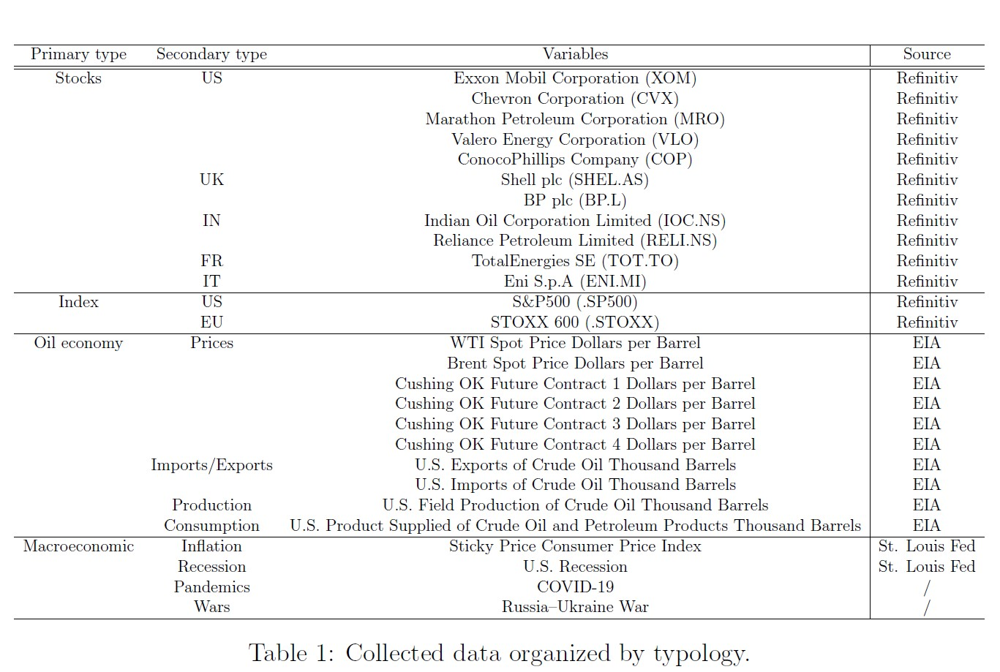

# Forecasting WTI Crude Oil Spot Prices

## Project Objective

In this work, the problem of forecasting the spot prices of West Texas Intermediate crude oil was addressed by considering and comparing two different approaches, performing both an econometric and a neural network analysis. Historic data about multiple variables over a period of 23 years were collected and preprocessed in order to organize and clean them. In the econometric analysis, GARCH models were used to extract conditional volatilities and linear models were used to forecast WTI spot prices. On the other hand, in the neural network analysis, a LSTM-based model was used to take into account the sequentiality of the data.

  

## Models

The objective of this project is to forecast the spot price of WTI crude oil by leveraging the previously illustrated explanatory variables. To this end, both models belonging to econometric and deep learning are used, and their performance is measured and compared.
In the econometric analysis, GARCH models are used to account for the heteroscedasticity of explanatory variables and estimate their volatility. Explanatory variables, together 8 with the conditional volatility of those having ARCH effect, are used then to forecast WTI crude oil prices employing linear models, both static and dynamic. The models used in the econometric analysis were built taking advantage of the library statsmodels.
In the neural network analysis, a specific deep learning model called long short-term memory (LSTM) is used to forecast WTI crude oil prices. The LSTM architecture is particularly efficient at modeling time series since it takes into account the sequentiality of data and is capable of learning long-term dependencies. The model used in the neural network analysis was built taking advantage of the framework PyTorch.

## Results

The results obtained in this work showed that the neural network model outperformed the econometric models in forecasting WTI spot prices. The neural network was able to produce accurate predictions on the overall dataset and demonstrated a strong performance on the test set, achieving a lower MSE compared to the best econometric model.
Nonetheless, it is important to note that neural networks are quite difficult to train, particularly on small datasets, and do not provide any insights about why certain values are predicted. In contrast, econometric models can offer a more interpretable approach by explicitly modeling the relationships between different variables.
In conclusion, the use of neural networks can be a useful approach to forecast prices of financial assets. However, relying on these predictions carries a high level of risk, as prices are influenced by many factors, and neural networks, unlike econometric models, do not provide explanations for their predictions. As such, it may be advisable to consider both neural network and econometric models when making financial forecasts.
